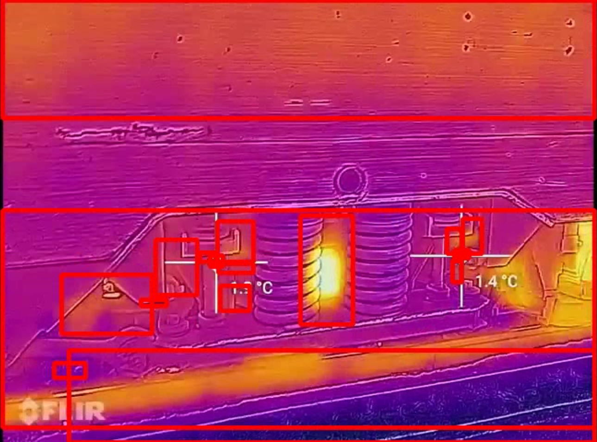

# High temperature recognition

Purpose of this project is to use computer vision and recognise hot temperatures on a
thermal camera recordings.

## Requirements

- numpy
- opencv
- pytest

`$ pip3 install -r requirements.txt`

## Run

`$ python3 main.py`

You can upload your own recording into raw/ directory.

### out/

Here you can find a new analized and updated version of your vour video.

### logs/

After successfully running the script you should receive a log file that will include coordinates of the area that is hot and a frame number that it appears on.

## Tests

`$ pytest tests.py`

(*press enter when it asks you for your input*)

You can change the video that will be tested by changing this line to the name of your recording in raw/ directory. 
`5|    main("test.mp4")`

### test_video

Runs the program and after it finishes, it will open log file and check its contents to see if the program managed to find any points of interests in the video.

### test_ouput

Check if there is an output video saved into directory out/

## Source

The video used for testing purposes was trimmed.
source:
[How Hot are Train Wheels - Thermal Imaging - Thermal Train - Heavy Machinery Thermal Vision](https://www.youtube.com/watch?v=ukCGdAm0rxc)
